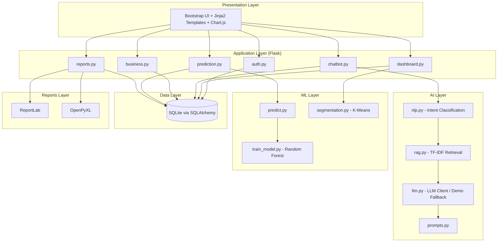
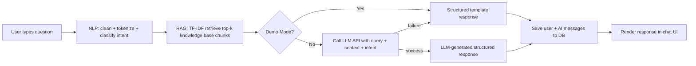
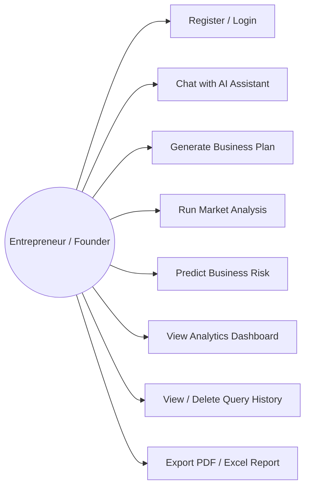
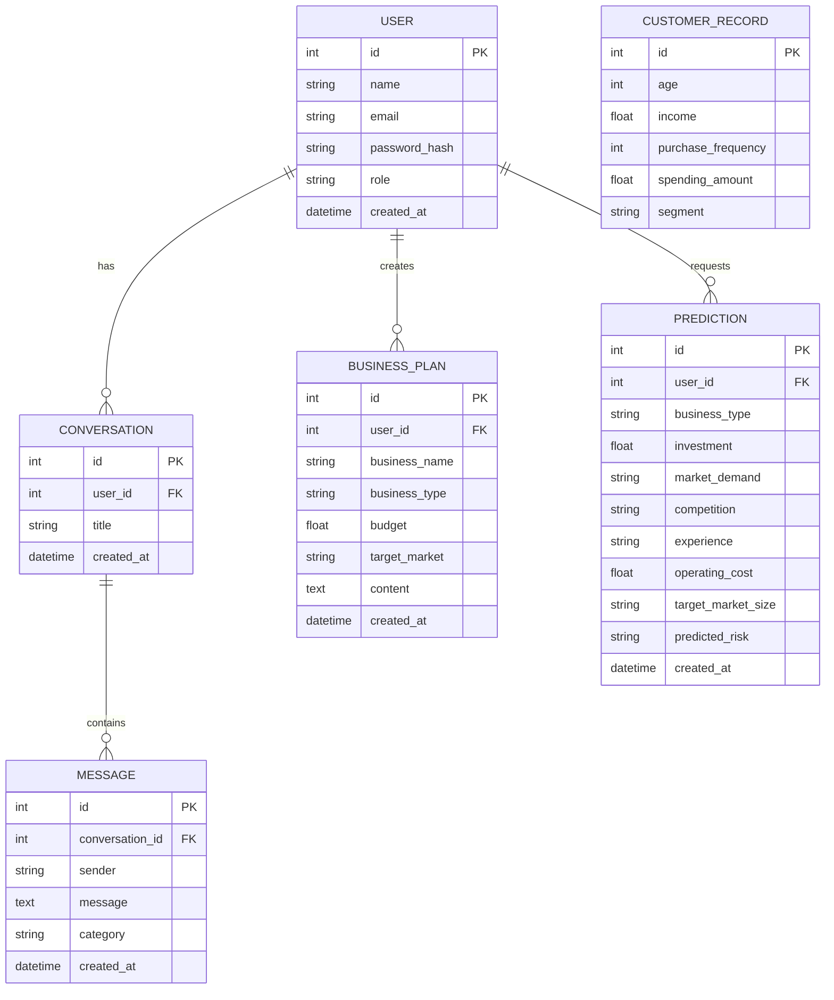
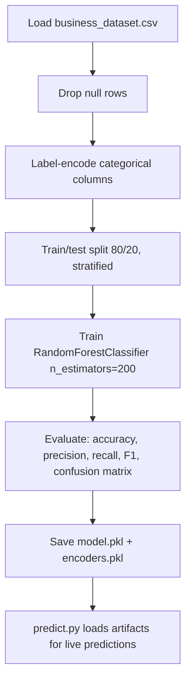
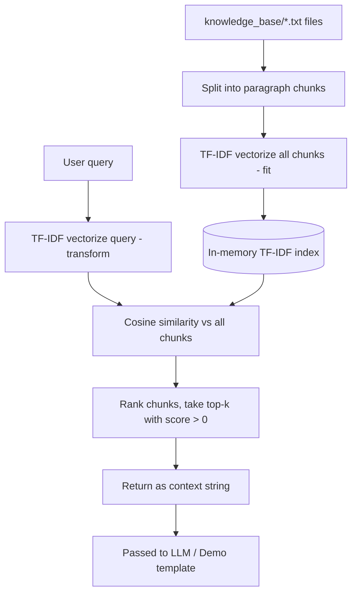
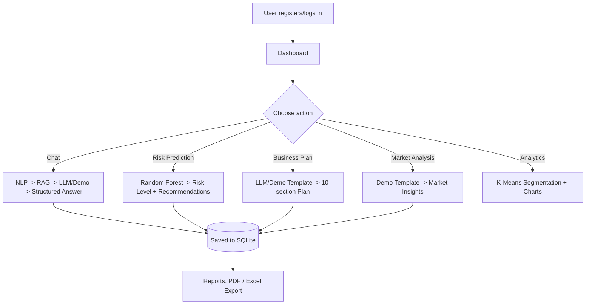

# System Diagrams (Mermaid)

Paste any block into https://mermaid.live to render, or view directly in
any Markdown viewer that supports Mermaid (GitHub, VS Code with the Mermaid
extension, etc.).

---

## 1. System Architecture

---

## 2. Data Flow Diagram (Chatbot Query)

---

## 3. Use Case Diagram

---

## 4. ER Diagram

---

## 5. ML Workflow (Risk Prediction Training)

---

## 6. RAG Workflow

---

## 7. Overall System Workflow

